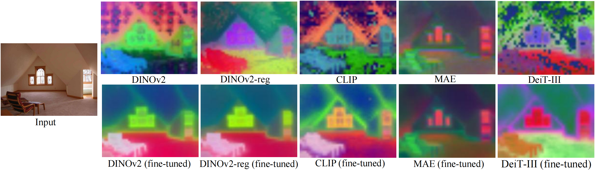

# Improving 2D Feature Representations by 3D-Aware Fine-Tuning
### ECCV 2024

[Yuanwen Yue](https://n.ethz.ch/~yuayue/) <sup>1</sup>,
[Anurag Das](https://www.mpi-inf.mpg.de/departments/computer-vision-and-machine-learning/people/anurag-das/) <sup>2</sup>,
[Francis Engelmann](https://francisengelmann.github.io/) <sup>1,3</sup>,
[Siyu Tang](https://vlg.inf.ethz.ch/team/Prof-Dr-Siyu-Tang.html) <sup>1</sup>,
[Jan Eric Lenssen](https://geometric-rl.mpi-inf.mpg.de/people/lenssen.html) <sup>2</sup>
<br>

**<sup>1</sup>ETH Zurich, <sup>2</sup>Max Planck Institute for Informatics, <sup>3</sup>Google**

### [Project Page](https://ywyue.github.io/FiT3D) | [Paper](http://arxiv.org/abs/2407.20229) 

<a href="https://huggingface.co/spaces/yuanwenyue/FiT3D">
  
</a>



This is the official repository (under construction) for the paper Improving 2D Feature Representations by 3D-Aware Fine-Tuning.

<details open="open" style='padding: 10px; border-radius:5px 30px 30px 5px; border-style: solid; border-width: 1px;'>
  <summary>Table of Contents</summary>
  <ol>
    <li>
      <a href="#preparation">Preparation</a>
    </li>
    <li>
      <a href="#demo">Demo</a>
    </li>
    <li>
      <a href="#training">Training</a>
    </li>
    <li>
      <a href="#evaluation">Evaluation</a>
    </li>
    <li>
      <a href="#citation">Citation</a>
    </li>
  </ol>
</details>


## Preparation

### Environment
* The code has been tested on Linux with Python 3.10.14, torch 1.9.0, and cuda 11.8.
* Create an environment and install pytorch and other required packages:
  ```shell
  git clone https://github.com/ywyue/FiT3D.git
  cd FiT3D
  conda create -n fit3d python=3.10
  conda activate fit3d
  pip install torch==2.0.0 torchvision==0.15.1 --index-url https://download.pytorch.org/whl/cu118
  pip install -r requirements.txt
  ```
* Compile the feature rasterization modules and the knn module for feature lifting:
  ```shell
  cd submodules/diff-gaussian-rasterization
  python setup.py install
  cd ../simple-knn/
  python setup.py install
  ```

### Data
We train feature Gaussians on ScanNet++ scenes. We follow the [ScanNet++ Toolkit](https://github.com/scannetpp/scannetpp) to undistort the DSLR images with OpenCV and downscale the images by a factor of 2. The processed data should be organized in a structure suitable for training Gaussian Splatting. We follow the ScanNet++ Toolkit to generate depth and 2D semantic segmentation ground truth. We will also release our preprocessing code soon. For all other evaluation datasets (ScanNet, NYUd, NYUv2, ADE20k, Pascal VOC, KITTI), please follow their official websites for downloading instructions.

## Demo
We provide a hugging face [demo](https://huggingface.co/spaces/yuanwenyue/FiT3D) where one can upload their own images and visualize the feature maps of the original 2D model and our fine-tuned model.

## Training
### Stage I: Lifting Features to 3D

### Stage II: 3D-Aware Fine-Tuning

## Evaluation

## Citation

If you find our code or paper useful, please cite:
```
@inproceedings{yue2024improving,
  title     = {{Improving 2D Feature Representations by 3D-Aware Fine-Tuning}},
  author    = {Yue, Yuanwen and Das, Anurag and Engelmann, Francis and Tang, Siyu and Lenssen, Jan Eric},
  booktitle = {European Conference on Computer Vision (ECCV)},
  year      = {2024}
}
```

